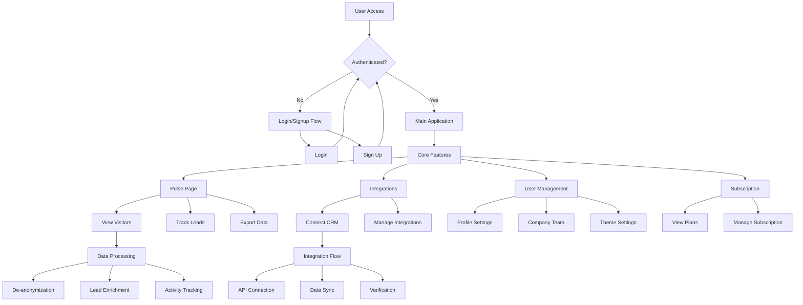
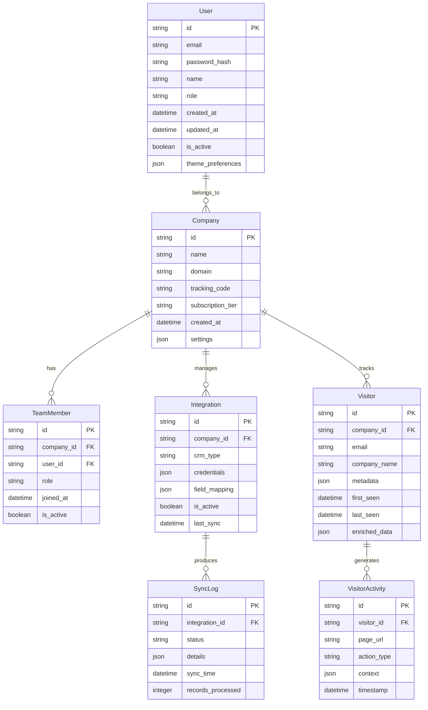
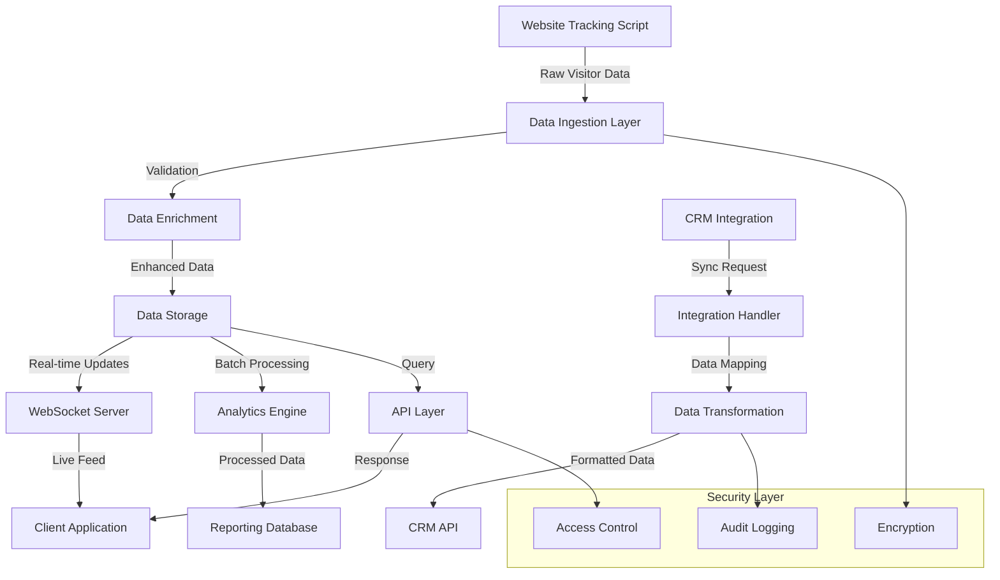
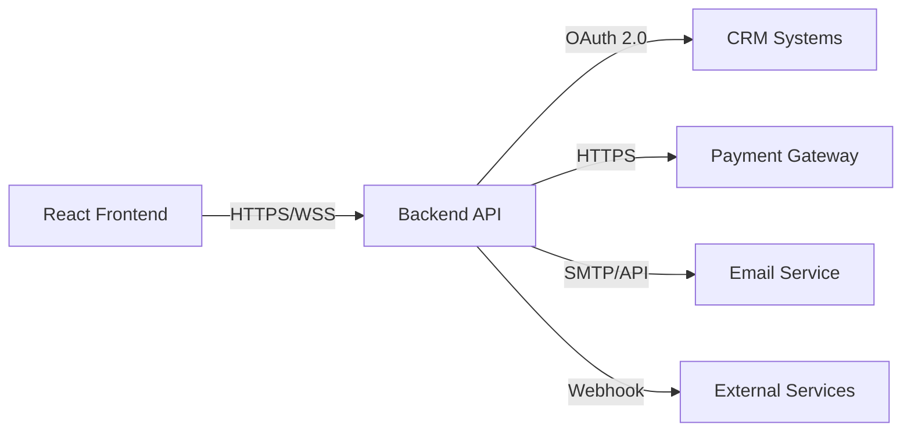
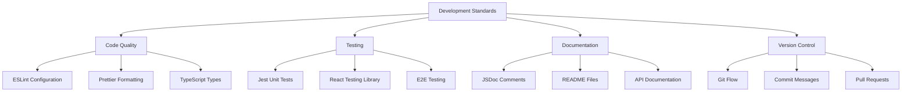

# Product Requirements Document (PRD)

# 1. INTRODUCTION

## 1.1 Purpose

This Product Requirements Document (PRD) outlines the comprehensive requirements for the Identity Matrix web application. It serves as the primary reference for stakeholders, developers, designers, and project managers involved in the development and implementation of the platform. This document ensures all parties have a clear understanding of the project's technical specifications, functional requirements, and expected deliverables.

## 1.2 Scope

Identity Matrix is a web-based application designed to de-anonymize website traffic for client websites. The platform will be developed using React.JS with Redux for state management and react-router-dom for routing.

### Core Functionalities:

- User authentication system (login/signup)
- Visitor tracking and lead management (Pulse page)
- CRM integration capabilities
- User and company team management
- Subscription management (Pricing)

### Key Technical Features:

- React.JS frontend framework
- Redux for API communication and state management
- Dark/light theme switching capability (default: dark)
- Primary brand color: #813efb
- Responsive design for multiple device compatibility

### Primary Modules:

1. Authentication Module

   - Login functionality
   - Sign-up system
   - Password management

2. Lead Management Module (Pulse)

   - Visitor tracking
   - Lead information display
   - Analytics dashboard

3. Integration Module

   - CRM integration options
   - API connectivity
   - Integration management

4. User Management Module

   - User profile settings
   - Company team management
   - Access control

# 2. PRODUCT DESCRIPTION

## 2.1 Product Perspective

Identity Matrix operates as a standalone web application that integrates with client websites through a tracking script. The system interfaces with:

- Client websites via JavaScript tracking code
- External CRM systems through API integrations
- Backend services for data processing and storage
- Authentication services for user management
- Payment processing systems for subscription handling

## 2.2 Product Functions

- Website Visitor De-anonymization

  - Real-time visitor tracking and identification
  - Lead information capture and enrichment
  - Visitor activity timeline tracking
  - Custom tracking parameters configuration

- Lead Management

  - Centralized lead database
  - Lead scoring and qualification
  - Lead activity monitoring
  - Export capabilities

- Team Collaboration

  - Multi-user access management
  - Role-based permissions
  - Team member activity tracking
  - Shared lead pools

- Integration Management

  - CRM system connections
  - API endpoint configuration
  - Data synchronization
  - Integration health monitoring

## 2.3 User Characteristics

1. Marketing Professionals

   - Primary users
   - Intermediate to advanced technical knowledge
   - Focus on lead generation and qualification
   - Regular daily usage

2. Sales Representatives

   - Secondary users
   - Basic technical knowledge
   - Focus on lead follow-up
   - Frequent but intermittent usage

3. System Administrators

   - Technical users
   - Advanced technical knowledge
   - Focus on system configuration and maintenance
   - Occasional usage

## 2.4 Constraints

1. Technical Constraints

   - React.JS framework limitations
   - Browser compatibility requirements
   - API rate limits
   - Real-time data processing capabilities

2. Security Constraints

   - GDPR compliance requirements
   - Data protection regulations
   - Secure data transmission protocols
   - Authentication security standards

3. Business Constraints

   - Integration limitations with third-party CRMs
   - Subscription tier restrictions
   - Data retention policies
   - Service level agreements

## 2.5 Assumptions and Dependencies

### Assumptions

- Users have modern web browsers
- Stable internet connectivity
- Basic understanding of CRM systems
- Client websites are compatible with tracking script
- Users have necessary permissions to install tracking code

### Dependencies

- Backend API availability
- Third-party CRM system uptime
- External data enrichment services
- Payment processing system functionality
- Cloud infrastructure reliability
- DNS and domain name services

# 3. PROCESS FLOWCHART

# 4. FUNCTIONAL REQUIREMENTS

## 4.1 Authentication System

### ID: F001

### Description

User authentication system allowing secure access to the platform through login and signup functionality.

### Priority: High

| Requirement ID | Requirement Description | Acceptance Criteria |
| --- | --- | --- |
| F001.1 | User Login | - Email and password authentication - Password strength validation - "Remember me" functionality - Password reset option |
| F001.2 | User Registration | - Email verification - Company information collection - Terms of service acceptance - Password creation rules |
| F001.3 | Password Management | - Secure password reset flow - Email-based verification - Password update functionality |

## 4.2 Pulse Page System

### ID: F002

### Description

Core visitor tracking and lead management interface displaying de-anonymized website visitors.

### Priority: High

| Requirement ID | Requirement Description | Acceptance Criteria |
| --- | --- | --- |
| F002.1 | Visitor List Display | - Real-time visitor updates - Sortable columns - Filterable data - Pagination support |
| F002.2 | Lead Information | - Visitor identification details - Company information - Visit timeline - Activity tracking |
| F002.3 | Export Functionality | - CSV export option - Custom field selection - Date range filtering |

## 4.3 Integration Management

### ID: F003

### Description

System for managing CRM integrations and external service connections.

### Priority: Medium

| Requirement ID | Requirement Description | Acceptance Criteria |
| --- | --- | --- |
| F003.1 | CRM Connections | - Available CRM list - OAuth authentication - Connection status monitoring |
| F003.2 | Integration Setup | - API key management - Field mapping interface - Test connection feature |
| F003.3 | Sync Management | - Manual sync triggers - Sync history logs - Error reporting |

## 4.4 User Settings

### ID: F004

### Description

Personal user profile and account management interface.

### Priority: Medium

| Requirement ID | Requirement Description | Acceptance Criteria |
| --- | --- | --- |
| F004.1 | Profile Management | - Name update - Email change with verification - Password modification |
| F004.2 | Theme Settings | - Dark/light theme toggle - Theme persistence - Real-time preview |
| F004.3 | Notification Settings | - Email notification preferences - In-app notification settings |

## 4.5 Company Team Management

### ID: F005

### Description

Interface for managing company team members and their access levels.

### Priority: Medium

| Requirement ID | Requirement Description | Acceptance Criteria |
| --- | --- | --- |
| F005.1 | Team Member Management | - Member invitation system - Role assignment - Access level control |
| F005.2 | Team Permissions | - Role-based access control - Custom permission sets - Permission inheritance |
| F005.3 | Activity Monitoring | - Team member activity logs - Login history - Action tracking |

## 4.6 Subscription Management

### ID: F006

### Description

Pricing and subscription management system.

### Priority: High

| Requirement ID | Requirement Description | Acceptance Criteria |
| --- | --- | --- |
| F006.1 | Plan Display | - Pricing tier comparison - Feature list by plan - Custom enterprise options |
| F006.2 | Subscription Handling | - Payment processing - Plan upgrades/downgrades - Billing history |
| F006.3 | Usage Tracking | - Resource usage monitoring - Usage limits enforcement - Overage notifications |

# 5. NON-FUNCTIONAL REQUIREMENTS

## 5.1 Performance Requirements

| Requirement | Description | Target Metric |
| --- | --- | --- |
| Response Time | Maximum time for page load and rendering | \< 2 seconds |
| API Response | Maximum time for API endpoint responses | \< 500ms |
| Real-time Updates | Maximum delay for visitor tracking updates | \< 3 seconds |
| Concurrent Users | Number of simultaneous users supported | 10,000+ |
| Browser Performance | Maximum CPU usage in browser | \< 30% |
| Memory Usage | Maximum browser memory consumption | \< 200MB |

## 5.2 Safety Requirements

| Requirement | Description | Implementation |
| --- | --- | --- |
| Data Backup | Regular backup of critical user data | Daily incremental, weekly full backup |
| Failure Recovery | System recovery from crashes or failures | Automatic failover within 5 minutes |
| Data Loss Prevention | Maximum acceptable data loss in case of failure | \< 5 minutes of data |
| State Management | Handling of incomplete transactions | Automatic rollback and user notification |
| Error Handling | Graceful handling of system errors | User-friendly error messages and logging |

## 5.3 Security Requirements

| Requirement | Description | Implementation |
| --- | --- | --- |
| Authentication | Secure user authentication process | JWT tokens with 24-hour expiration |
| Authorization | Role-based access control | Granular permission system |
| Data Encryption | Encryption of sensitive data | AES-256 for data at rest, TLS 1.3 in transit |
| Session Management | Secure handling of user sessions | HTTP-only cookies, CSRF protection |
| API Security | Protection of API endpoints | Rate limiting, API key authentication |
| Password Security | Password storage and management | Bcrypt hashing, minimum complexity requirements |

## 5.4 Quality Requirements

### 5.4.1 Availability

- System uptime: 99.9%
- Planned maintenance windows: \< 4 hours monthly
- Maximum unplanned downtime: 1 hour per month

### 5.4.2 Maintainability

- Modular React component architecture
- Comprehensive documentation
- Automated testing coverage \> 80%
- Code quality metrics enforcement

### 5.4.3 Usability

- Mobile-responsive design
- WCAG 2.1 Level AA compliance
- Maximum 3 clicks to reach any feature
- Consistent UI/UX across all pages

### 5.4.4 Scalability

- Horizontal scaling capability
- Support for 100% traffic increase within 1 hour
- Database partitioning support
- Microservices architecture ready

### 5.4.5 Reliability

- Mean Time Between Failures (MTBF): \> 720 hours
- Mean Time To Recovery (MTTR): \< 30 minutes
- Error rate: \< 0.1% of all requests
- Data accuracy: 99.99%

## 5.5 Compliance Requirements

| Requirement | Description | Implementation |
| --- | --- | --- |
| GDPR | European data protection compliance | Data privacy controls, user consent management |
| CCPA | California Consumer Privacy Act compliance | Data deletion, access controls |
| PIPEDA | Canadian privacy law compliance | Data handling and storage policies |
| SOC 2 | Security and availability compliance | Regular audits and reporting |
| ISO 27001 | Information security standards | Security controls and documentation |
| Browser Standards | Web standards compliance | HTML5, CSS3, ECMAScript compliance |

# 6. DATA REQUIREMENTS

## 6.1 Data Models

## 6.2 Data Storage

### 6.2.1 Primary Storage

- PostgreSQL for relational data (Users, Companies, Team Members)
- MongoDB for visitor tracking and activity data
- Redis for caching and real-time data

### 6.2.2 Data Retention

- Active visitor data: 12 months
- Activity logs: 6 months
- User account data: Duration of account + 30 days
- Integration logs: 3 months
- Sync history: 6 months

### 6.2.3 Backup Strategy

- Daily incremental backups
- Weekly full backups
- Cross-region backup replication
- 30-day backup retention
- Point-in-time recovery capability

### 6.2.4 Data Redundancy

- Multi-AZ database deployment
- Read replicas for high availability
- Geographic data replication
- Hot standby instances

## 6.3 Data Processing

### 6.3.1 Data Security

- End-to-end encryption for data in transit
- AES-256 encryption for sensitive data at rest
- Field-level encryption for PII
- Regular security audits
- Access logging and monitoring

### 6.3.2 Data Processing Rules

- Real-time visitor data processing
- Asynchronous enrichment pipeline
- Batch processing for analytics
- Rate limiting for API endpoints
- Data validation at ingestion

### 6.3.3 Data Transformation

- JSON schema validation
- Data normalization
- Field mapping for CRM integration
- Data enrichment pipeline
- Format standardization

### 6.3.4 Data Access Patterns

- Read-heavy optimization
- Caching strategy for frequent queries
- Pagination for large datasets
- Partial response support
- Bulk operation handling

# 7. EXTERNAL INTERFACES

## 7.1 User Interfaces

### 7.1.1 General UI Requirements

- Responsive design supporting desktop (1920x1080) to mobile (320px minimum width)
- Dark/light theme support with system preference detection
- Primary color (#813efb) consistent across all interfaces
- Material Design-inspired components
- Loading states for all async operations
- Error handling with user-friendly messages

### 7.1.2 Page-Specific Requirements

| Page | Key UI Elements | Responsive Behavior |
| --- | --- | --- |
| Login | - Email/password fields - Remember me checkbox - Forgot password link - Sign up link | Single column on mobile |
| Sign Up | - Registration form - Terms acceptance - Email verification UI | Progressive disclosure on mobile |
| Pricing | - Plan comparison table - Feature lists - CTA buttons | Horizontal scroll on mobile |
| Pulse | - Visitor list table - Search/filter controls - Lead details panel | List view on mobile |
| Integrations | - CRM card grid - Connection status indicators - Setup wizards | Vertical stack on mobile |
| User Settings | - Form fields - Theme toggle - Save buttons | Full width forms on mobile |
| Company Team | - Member list - Role indicators - Invite interface | Condensed list on mobile |

## 7.2 Software Interfaces

### 7.2.1 Frontend Framework

- React.JS 18.x
- Redux for state management
- React Router DOM for navigation
- Axios for HTTP requests
- WebSocket connection for real-time updates

### 7.2.2 External Services Integration

| Service Type | Interface Method | Data Format |
| --- | --- | --- |
| Backend API | RESTful API | JSON |
| CRM Systems | OAuth 2.0 | JSON/XML |
| Analytics | REST/WebSocket | JSON |
| Payment Processing | REST API | JSON |
| Email Service | SMTP/API | MIME/JSON |

### 7.2.3 Browser Compatibility

- Chrome (latest 2 versions)
- Firefox (latest 2 versions)
- Safari (latest 2 versions)
- Edge (latest 2 versions)
- Mobile browsers (iOS Safari, Android Chrome)

## 7.3 Communication Interfaces

### 7.3.1 Network Protocols

- HTTPS for all API communications
- WSS for WebSocket connections
- TLS 1.3 for transport security

### 7.3.2 API Specifications

| Endpoint Type | Protocol | Authentication |
| --- | --- | --- |
| REST API | HTTPS | JWT Bearer Token |
| WebSocket | WSS | Token-based |
| Webhook | HTTPS | API Key |
| OAuth | HTTPS | OAuth 2.0 |

### 7.3.3 Data Exchange Formats

- JSON for API requests/responses
- JWT for authentication tokens
- Base64 for binary data
- UTF-8 encoding for text
- ISO 8601 for dates/times

### 7.3.4 Integration Protocols

# 8. APPENDICES

## 8.1 GLOSSARY

| Term | Definition |
| --- | --- |
| De-anonymization | The process of identifying previously anonymous website visitors by analyzing their digital footprint and behavior patterns |
| Lead | A website visitor whose identity has been revealed through the de-anonymization process |
| CRM | Customer Relationship Management system used to manage interactions with customers and potential customers |
| Pulse Page | The main dashboard showing real-time visitor tracking and lead information |
| Integration | Connection between Identity Matrix and external CRM systems |
| Tracking Script | JavaScript code snippet installed on client websites to monitor visitor activity |
| Team Member | A user belonging to a company account with specific assigned roles and permissions |

## 8.2 ACRONYMS

| Acronym | Full Form |
| --- | --- |
| API | Application Programming Interface |
| CRM | Customer Relationship Management |
| JWT | JSON Web Token |
| REST | Representational State Transfer |
| UI | User Interface |
| UX | User Experience |
| WSS | WebSocket Secure |
| PII | Personally Identifiable Information |
| CRUD | Create, Read, Update, Delete |
| SPA | Single Page Application |

## 8.3 ADDITIONAL REFERENCES

### 8.3.1 Technical Documentation

| Resource | Description | URL |
| --- | --- | --- |
| React.js Documentation | Official React.js framework documentation | https://reactjs.org/docs |
| Redux Documentation | State management library documentation | https://redux.js.org |
| React Router Documentation | Client-side routing library documentation | https://reactrouter.com |
| Material Design Guidelines | UI/UX design principles and components | https://material.io |

### 8.3.2 Development Standards

### 8.3.3 Compliance Resources

| Resource | Purpose | Relevance |
| --- | --- | --- |
| GDPR Guidelines | Data protection compliance | Visitor tracking and PII handling |
| CCPA Documentation | California privacy law | US visitor data management |
| PIPEDA Resources | Canadian privacy law | Canadian market compliance |
| Web Content Accessibility Guidelines | Accessibility standards | UI/UX implementation |