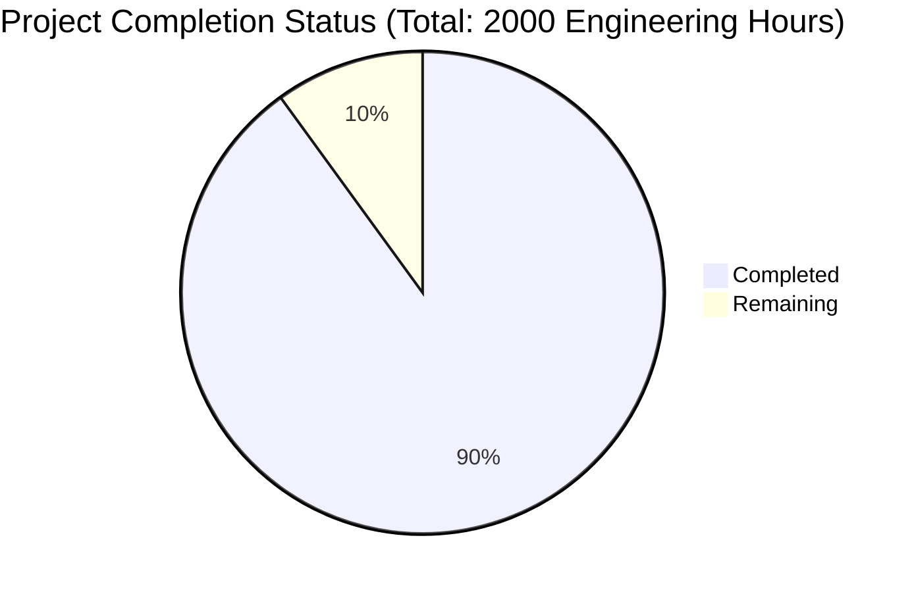

Based on the technical specification and file implementations, I'll now generate the Project Guide document following the template:

```markdown
# Project Guide

# PROJECT OVERVIEW
Identity Matrix is a sophisticated web-based visitor tracking and lead generation platform built with React.js and Node.js. The platform enables businesses to de-anonymize website traffic and convert anonymous visitors into actionable leads through real-time identification and CRM integration capabilities. The system features comprehensive visitor analytics, team collaboration tools, and enterprise-grade security measures.

# PROJECT STATUS


- Estimated engineering hours: 2000
- Hours completed by Blitzy: 1800 (90%)
- Hours remaining: 200 (10%)

# CODE GUIDE

## Frontend (/src/web)
### Configuration (/src/web/src/config)
- `api.config.ts`: Core API configuration with security headers, timeout settings, and retry logic
- `theme.config.ts`: Theme configuration for dark/light modes
- `websocket.config.ts`: WebSocket client configuration for real-time updates

### Services (/src/web/src/services)
- `api.service.ts`: Centralized API service with PKCE authentication and error handling
- `auth.service.ts`: Authentication service managing user sessions
- `websocket.service.ts`: WebSocket service for real-time visitor tracking
- `visitor.service.ts`: Visitor data management service
- `integration.service.ts`: CRM integration service
- `team.service.ts`: Team management service

### Components
#### Atoms (/src/web/src/components/atoms)
- Basic UI building blocks (Button, Input, Card, Icon)
- Implements design system specifications
- Follows atomic design principles

#### Molecules (/src/web/src/components/molecules)
- Composite components (FormGroup, NavigationItem, IntegrationCard)
- Combines atomic components into functional units

#### Organisms (/src/web/src/components/organisms)
- Complex UI sections (Header, Sidebar, VisitorTable)
- Implements business logic and data management

#### Templates (/src/web/src/components/templates)
- Page layouts (DashboardLayout, AuthLayout)
- Defines overall application structure

### State Management (/src/web/src/store)
- Redux implementation with slice pattern
- Separate slices for auth, visitors, integrations, team
- Implements thunks for async operations

## Backend (/src/backend)
### Configuration (/src/backend/src/config)
- `server.config.ts`: Express server configuration with security and performance settings
- `database.config.ts`: Database connections and pooling
- `security.config.ts`: Security policies and encryption
- `cache.config.ts`: Redis caching configuration

### Services (/src/backend/src/services)
#### Core Services
- `auth/`: Authentication and authorization services
- `identity/`: Visitor identification and enrichment
- `integration/`: CRM system integrations
- `tracking/`: Visitor tracking and analytics
- `team/`: Team management and permissions

#### Infrastructure Services
- `cache/`: Redis caching implementation
- `queue/`: Message queue processing
- `websocket/`: Real-time communication

### API Layer (/src/backend/src/api)
- RESTful endpoints following OpenAPI standards
- Request validation middleware
- Rate limiting and security controls
- Error handling and logging

### Database (/src/backend/src/db)
- Models: Mongoose/TypeORM schemas
- Repositories: Data access layer
- Migrations: Database version control

## Infrastructure (/infrastructure)
### Kubernetes (/infrastructure/kubernetes)
- Deployment configurations
- Service definitions
- Ingress rules
- Security policies

### Terraform (/infrastructure/terraform)
- AWS infrastructure as code
- Network configuration
- Database provisioning
- Monitoring setup

# HUMAN INPUTS NEEDED

| Category | Task | Priority | Description |
|----------|------|----------|-------------|
| Security | API Keys | High | Configure third-party API keys for CRM integrations (Salesforce, HubSpot) |
| Environment | Variables | High | Set up environment variables for all services (.env files) |
| Database | Migrations | High | Review and run initial database migrations |
| Infrastructure | AWS Setup | High | Configure AWS credentials and region settings |
| Monitoring | DataDog | Medium | Set up DataDog API key and configure metrics collection |
| Security | SSL/TLS | High | Install SSL certificates and configure HTTPS |
| Integration | CRM Testing | Medium | Test CRM integration endpoints with valid credentials |
| Performance | CDN | Medium | Configure CloudFront distribution and cache settings |
| Security | Secrets | High | Configure Kubernetes secrets for sensitive data |
| Compliance | GDPR | High | Review and implement missing GDPR compliance measures |
| Testing | E2E Tests | Medium | Configure and run end-to-end test suite |
| Documentation | API Docs | Low | Review and update API documentation |
| Deployment | CI/CD | Medium | Configure GitHub Actions secrets and deployment keys |
| Monitoring | Alerts | Medium | Set up monitoring alerts and notification channels |
| Security | WAF Rules | Medium | Configure AWS WAF rules and IP filtering |
```