# Technical Specifications

# 1. INTRODUCTION

## 1.1 EXECUTIVE SUMMARY

Identity Matrix is a web-based visitor tracking and lead generation platform designed to de-anonymize website traffic for businesses. The system provides real-time identification of website visitors, enabling companies to convert anonymous traffic into actionable leads. Built with React.JS and modern web technologies, the platform offers seamless CRM integration, team collaboration features, and comprehensive visitor analytics.

The solution addresses the critical business challenge of identifying and qualifying potential customers from website traffic, providing organizations with enhanced lead generation capabilities and deeper insights into visitor behavior. Primary stakeholders include marketing professionals, sales teams, and system administrators who will benefit from improved lead quality, streamlined workflows, and increased conversion rates.

## 1.2 SYSTEM OVERVIEW

### Project Context

| Aspect | Description |
|--------|-------------|
| Market Position | Lead generation and visitor tracking solution for B2B companies |
| Current Landscape | Integration with existing CRM systems and marketing tools |
| Technical Environment | Modern web application leveraging React.JS ecosystem |
| Target Market | B2B companies seeking to optimize lead generation |

### High-Level Description

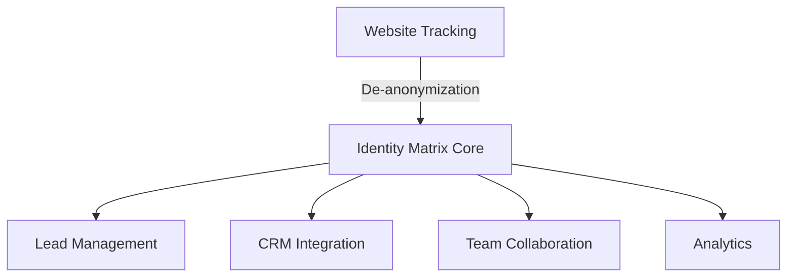
```mermaid
graph TD
    A[Website Tracking] -->|De-anonymization| B[Identity Matrix Core]
    B --> C[Lead Management]
    B --> D[CRM Integration]
    B --> E[Team Collaboration]
    B --> F[Analytics]
```

### Success Criteria

| Category | Metrics |
|----------|---------|
| Performance | - Page load time < 2s<br>- API response time < 500ms<br>- 99.9% system uptime |
| Business | - Lead identification accuracy > 95%<br>- CRM integration success rate > 99%<br>- User adoption rate > 80% |
| Technical | - Test coverage > 80%<br>- Zero critical security vulnerabilities<br>- Browser compatibility > 95% |

## 1.3 SCOPE

### In-Scope Elements

| Component | Features |
|-----------|----------|
| Authentication | - User login/signup<br>- Password management<br>- Session handling |
| Lead Management | - Visitor tracking<br>- De-anonymization<br>- Lead enrichment |
| Team Features | - Company team management<br>- Role-based access<br>- Collaboration tools |
| Integrations | - CRM connections<br>- API interfaces<br>- Data synchronization |
| User Interface | - Dark/light theme<br>- Responsive design<br>- Modern UI components |

### Implementation Boundaries

| Boundary Type | Coverage |
|--------------|----------|
| User Groups | Marketing teams, Sales representatives, System administrators |
| System Access | Web-based interface, API access |
| Data Handling | Visitor data, User data, Integration data |
| Security | Role-based access control, Data encryption |

### Out-of-Scope Elements

- Mobile native applications
- Offline functionality
- Custom CRM development
- Legacy browser support
- Real-time chat features
- Advanced analytics and reporting
- Custom integration development
- Third-party plugin system
- White-label solutions
- Multi-language support (initial release)

# 2. SYSTEM ARCHITECTURE

## 2.1 High-Level Architecture

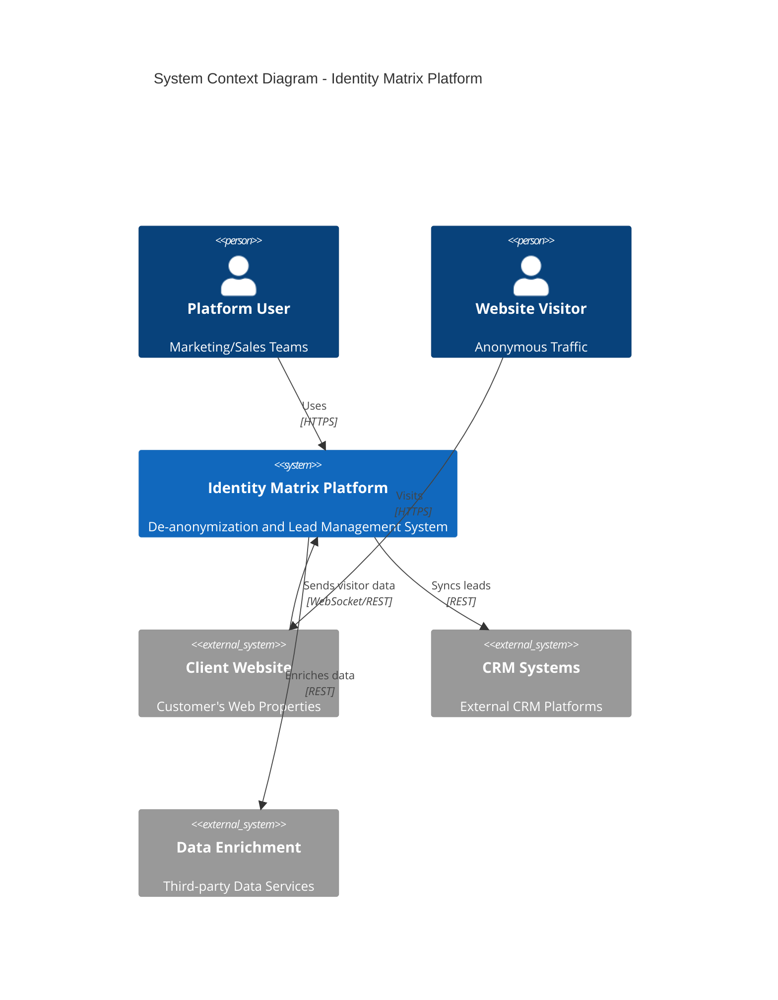
```mermaid
C4Context
    title System Context Diagram - Identity Matrix Platform

    Person(user, "Platform User", "Marketing/Sales Teams")
    Person(visitor, "Website Visitor", "Anonymous Traffic")
    
    System(identityMatrix, "Identity Matrix Platform", "De-anonymization and Lead Management System")
    
    System_Ext(clientWebsite, "Client Website", "Customer's Web Properties")
    System_Ext(crm, "CRM Systems", "External CRM Platforms")
    System_Ext(enrichment, "Data Enrichment", "Third-party Data Services")
    
    Rel(user, identityMatrix, "Uses", "HTTPS")
    Rel(visitor, clientWebsite, "Visits", "HTTPS")
    Rel(clientWebsite, identityMatrix, "Sends visitor data", "WebSocket/REST")
    Rel(identityMatrix, crm, "Syncs leads", "REST")
    Rel(identityMatrix, enrichment, "Enriches data", "REST")
```

## 2.2 Component Details

### 2.2.1 Core Components

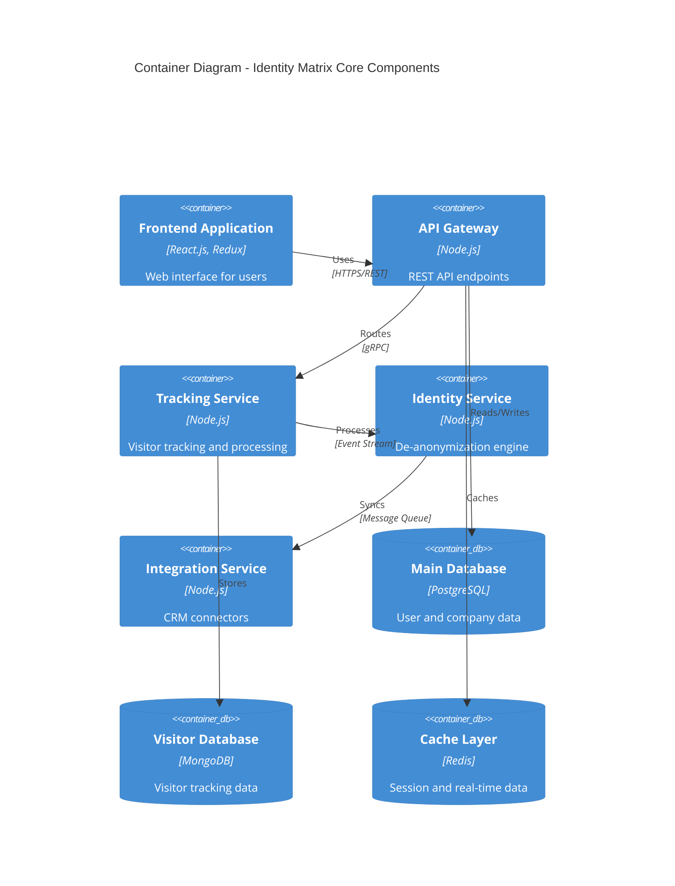
```mermaid
C4Container
    title Container Diagram - Identity Matrix Core Components

    Container(frontend, "Frontend Application", "React.js, Redux", "Web interface for users")
    Container(api, "API Gateway", "Node.js", "REST API endpoints")
    Container(tracking, "Tracking Service", "Node.js", "Visitor tracking and processing")
    Container(identity, "Identity Service", "Node.js", "De-anonymization engine")
    Container(integration, "Integration Service", "Node.js", "CRM connectors")
    
    ContainerDb(mainDb, "Main Database", "PostgreSQL", "User and company data")
    ContainerDb(visitorDb, "Visitor Database", "MongoDB", "Visitor tracking data")
    ContainerDb(cache, "Cache Layer", "Redis", "Session and real-time data")
    
    Rel(frontend, api, "Uses", "HTTPS/REST")
    Rel(api, tracking, "Routes", "gRPC")
    Rel(tracking, identity, "Processes", "Event Stream")
    Rel(identity, integration, "Syncs", "Message Queue")
    
    Rel(api, mainDb, "Reads/Writes")
    Rel(tracking, visitorDb, "Stores")
    Rel(api, cache, "Caches")
```

### 2.2.2 Component Specifications

| Component | Technology | Purpose | Scaling Strategy |
|-----------|------------|---------|------------------|
| Frontend | React.js, Redux | User interface | Horizontal with CDN |
| API Gateway | Node.js | Request routing | Horizontal with load balancer |
| Tracking Service | Node.js | Visitor data collection | Auto-scaling based on traffic |
| Identity Service | Node.js | De-anonymization logic | Horizontal with queue |
| Integration Service | Node.js | CRM connectivity | Horizontal per integration |

## 2.3 Technical Decisions

### 2.3.1 Architecture Pattern

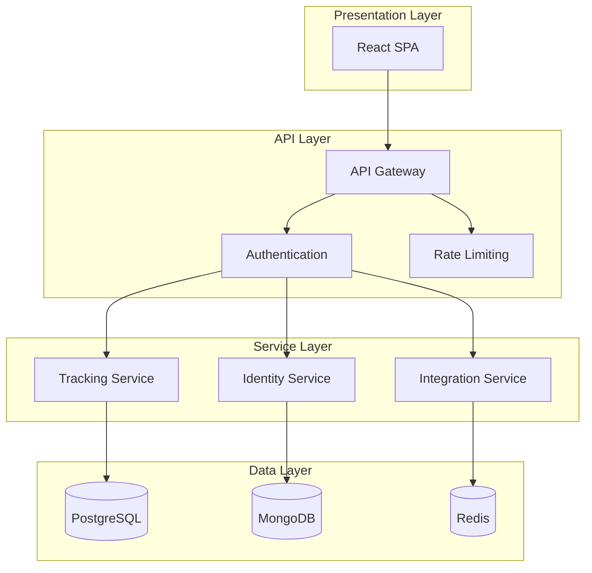
```mermaid
flowchart TD
    subgraph "Presentation Layer"
        A[React SPA]
    end
    
    subgraph "API Layer"
        B[API Gateway]
        C[Authentication]
        D[Rate Limiting]
    end
    
    subgraph "Service Layer"
        E[Tracking Service]
        F[Identity Service]
        G[Integration Service]
    end
    
    subgraph "Data Layer"
        H[(PostgreSQL)]
        I[(MongoDB)]
        J[(Redis)]
    end
    
    A --> B
    B --> C
    B --> D
    C --> E
    C --> F
    C --> G
    E --> H
    F --> I
    G --> J
```

### 2.3.2 Data Flow Architecture

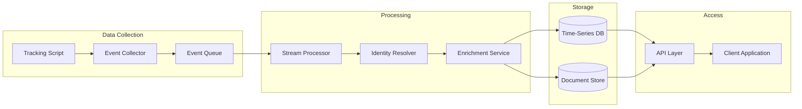
```mermaid
flowchart LR
    subgraph "Data Collection"
        A[Tracking Script] --> B[Event Collector]
        B --> C[Event Queue]
    end
    
    subgraph "Processing"
        C --> D[Stream Processor]
        D --> E[Identity Resolver]
        E --> F[Enrichment Service]
    end
    
    subgraph "Storage"
        F --> G[(Time-Series DB)]
        F --> H[(Document Store)]
    end
    
    subgraph "Access"
        G --> I[API Layer]
        H --> I
        I --> J[Client Application]
    end
```

## 2.4 Cross-Cutting Concerns

### 2.4.1 System Monitoring

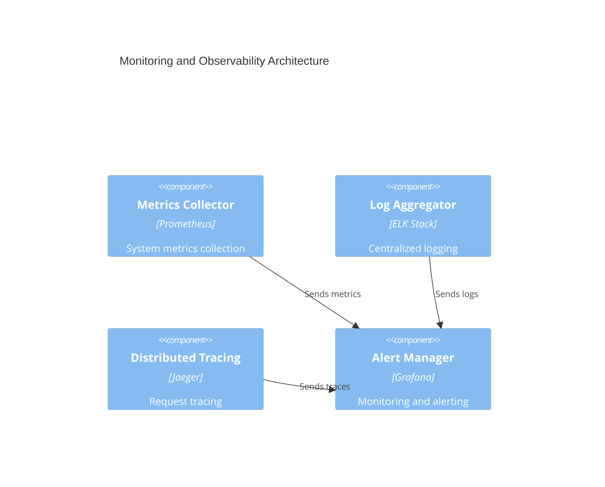
```mermaid
C4Component
    title Monitoring and Observability Architecture

    Component(metrics, "Metrics Collector", "Prometheus", "System metrics collection")
    Component(logs, "Log Aggregator", "ELK Stack", "Centralized logging")
    Component(trace, "Distributed Tracing", "Jaeger", "Request tracing")
    Component(alert, "Alert Manager", "Grafana", "Monitoring and alerting")
    
    Rel(metrics, alert, "Sends metrics")
    Rel(logs, alert, "Sends logs")
    Rel(trace, alert, "Sends traces")
```

### 2.4.2 Security Architecture

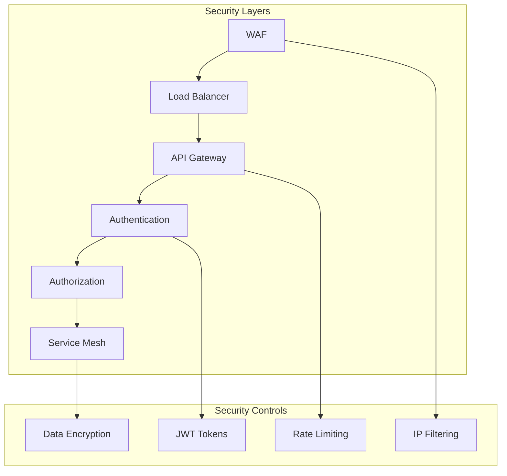
```mermaid
flowchart TD
    subgraph "Security Layers"
        A[WAF] --> B[Load Balancer]
        B --> C[API Gateway]
        C --> D[Authentication]
        D --> E[Authorization]
        E --> F[Service Mesh]
    end
    
    subgraph "Security Controls"
        G[JWT Tokens]
        H[Rate Limiting]
        I[IP Filtering]
        J[Data Encryption]
    end
    
    D --> G
    C --> H
    A --> I
    F --> J
```

## 2.5 Deployment Architecture

```mermaid
C4Deployment
    title Production Deployment Architecture

    Deployment_Node(cdn, "CDN", "CloudFront"){
        Container(static, "Static Assets")
    }
    
    Deployment_Node(aws, "AWS Cloud"){
        Deployment_Node(eks, "Kubernetes Cluster"){
            Container(frontend, "Frontend Service")
            Container(api, "API Service")
            Container(tracking, "Tracking Service")
        }
        
        Deployment_Node(dbs, "Database Cluster"){
            ContainerDb(rds, "RDS PostgreSQL")
            ContainerDb(mongo, "MongoDB Atlas")
            ContainerDb(redis, "ElastiCache Redis")
        }
    }
    
    Rel(cdn, eks, "Routes traffic", "HTTPS")
    Rel(eks, dbs, "Persists data", "Encrypted")
```

# 3. SYSTEM COMPONENTS ARCHITECTURE

## 3.1 USER INTERFACE DESIGN

### 3.1.1 Design System Specifications

| Component | Specification | Implementation Details |
|-----------|--------------|------------------------|
| Color Scheme | Primary: #813efb<br>Dark Theme: #1a1a1a<br>Light Theme: #ffffff | Theme-aware components with CSS variables |
| Typography | Headings: Inter<br>Body: Roboto<br>Code: Fira Code | Font loading optimization with preconnect |
| Spacing | Base unit: 8px<br>Grid: 12-column system | Responsive grid with CSS Grid/Flexbox |
| Breakpoints | Mobile: 320px<br>Tablet: 768px<br>Desktop: 1024px | Mobile-first media queries |
| Accessibility | WCAG 2.1 Level AA | ARIA labels, keyboard navigation, focus management |

### 3.1.2 Component Library Structure

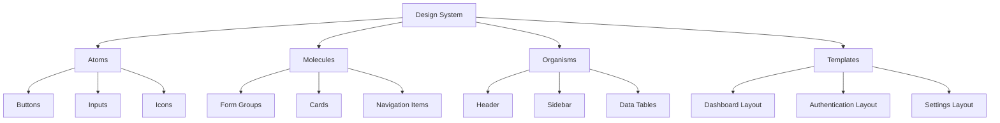
```mermaid
graph TD
    A[Design System] --> B[Atoms]
    A --> C[Molecules]
    A --> D[Organisms]
    A --> E[Templates]
    
    B --> B1[Buttons]
    B --> B2[Inputs]
    B --> B3[Icons]
    
    C --> C1[Form Groups]
    C --> C2[Cards]
    C --> C3[Navigation Items]
    
    D --> D1[Header]
    D --> D2[Sidebar]
    D --> D3[Data Tables]
    
    E --> E1[Dashboard Layout]
    E --> E2[Authentication Layout]
    E --> E3[Settings Layout]
```

### 3.1.3 Critical User Flows

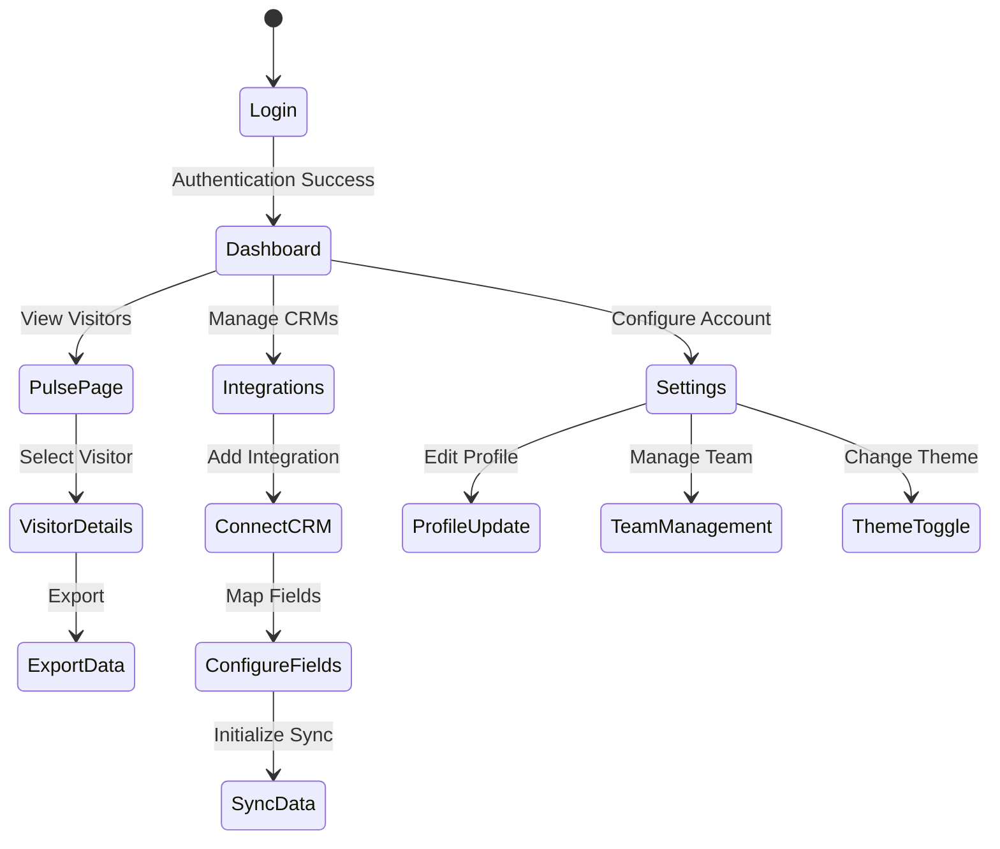
```mermaid
stateDiagram-v2
    [*] --> Login
    Login --> Dashboard: Authentication Success
    Dashboard --> PulsePage: View Visitors
    Dashboard --> Integrations: Manage CRMs
    Dashboard --> Settings: Configure Account
    
    PulsePage --> VisitorDetails: Select Visitor
    VisitorDetails --> ExportData: Export
    
    Integrations --> ConnectCRM: Add Integration
    ConnectCRM --> ConfigureFields: Map Fields
    ConfigureFields --> SyncData: Initialize Sync
    
    Settings --> ProfileUpdate: Edit Profile
    Settings --> TeamManagement: Manage Team
    Settings --> ThemeToggle: Change Theme
```

## 3.2 DATABASE DESIGN

### 3.2.1 Schema Design

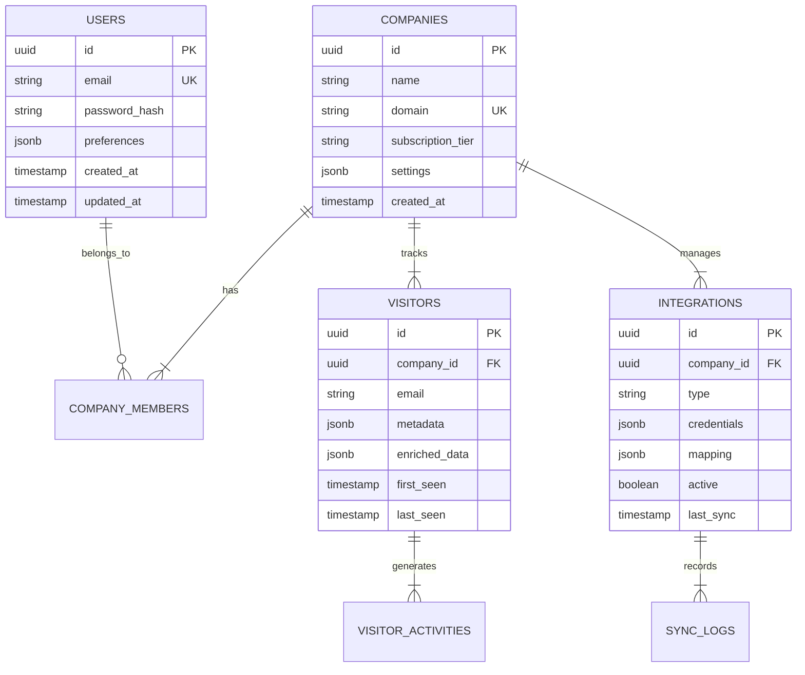
```mermaid
erDiagram
    USERS ||--o{ COMPANY_MEMBERS : belongs_to
    COMPANIES ||--|{ COMPANY_MEMBERS : has
    COMPANIES ||--|{ VISITORS : tracks
    COMPANIES ||--|{ INTEGRATIONS : manages
    VISITORS ||--|{ VISITOR_ACTIVITIES : generates
    INTEGRATIONS ||--|{ SYNC_LOGS : records

    USERS {
        uuid id PK
        string email UK
        string password_hash
        jsonb preferences
        timestamp created_at
        timestamp updated_at
    }

    COMPANIES {
        uuid id PK
        string name
        string domain UK
        string subscription_tier
        jsonb settings
        timestamp created_at
    }

    VISITORS {
        uuid id PK
        uuid company_id FK
        string email
        jsonb metadata
        jsonb enriched_data
        timestamp first_seen
        timestamp last_seen
    }

    INTEGRATIONS {
        uuid id PK
        uuid company_id FK
        string type
        jsonb credentials
        jsonb mapping
        boolean active
        timestamp last_sync
    }
```

### 3.2.2 Data Management Strategy

| Aspect | Strategy | Implementation |
|--------|----------|----------------|
| Partitioning | Time-based partitioning for visitor data | Monthly partitions with range partitioning |
| Indexing | Composite indexes for frequent queries | B-tree indexes on search columns |
| Caching | Multi-level caching strategy | Redis for session/real-time data |
| Archival | Automated archival after retention period | S3 cold storage for archived data |
| Backup | Daily incremental, weekly full backups | Point-in-time recovery enabled |

## 3.3 API DESIGN

### 3.3.1 API Architecture

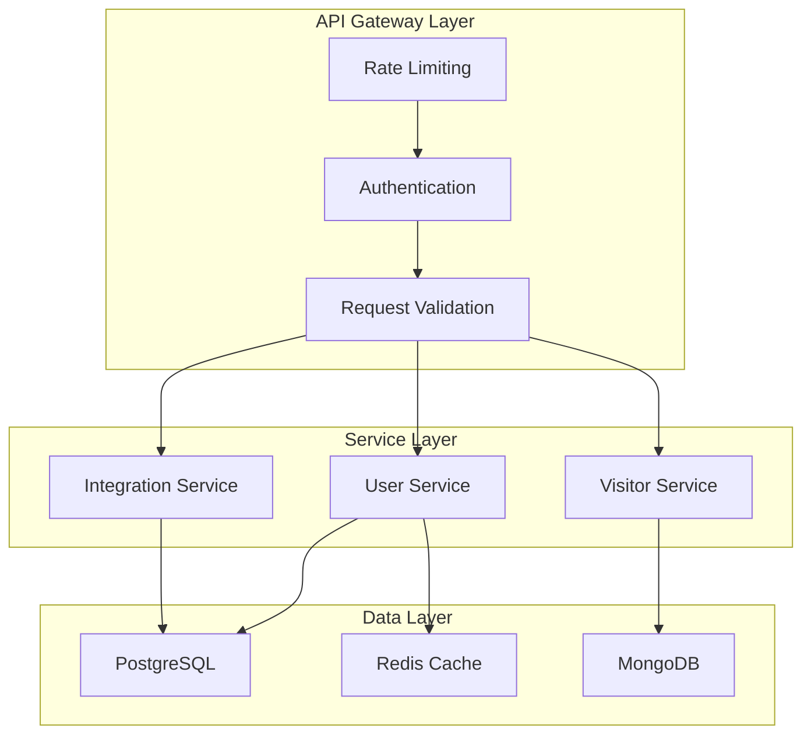
```mermaid
graph TD
    subgraph "API Gateway Layer"
        A[Rate Limiting]
        B[Authentication]
        C[Request Validation]
    end
    
    subgraph "Service Layer"
        D[User Service]
        E[Visitor Service]
        F[Integration Service]
    end
    
    subgraph "Data Layer"
        G[PostgreSQL]
        H[Redis Cache]
        I[MongoDB]
    end
    
    A --> B
    B --> C
    C --> D
    C --> E
    C --> F
    
    D --> G
    D --> H
    E --> I
    F --> G
```

### 3.3.2 API Endpoints

| Endpoint | Method | Description | Authentication |
|----------|--------|-------------|----------------|
| `/api/v1/auth/login` | POST | User authentication | Public |
| `/api/v1/auth/register` | POST | User registration | Public |
| `/api/v1/visitors` | GET | List visitors | JWT |
| `/api/v1/visitors/:id` | GET | Get visitor details | JWT |
| `/api/v1/integrations` | GET | List integrations | JWT |
| `/api/v1/team` | GET | List team members | JWT |

### 3.3.3 Integration Patterns

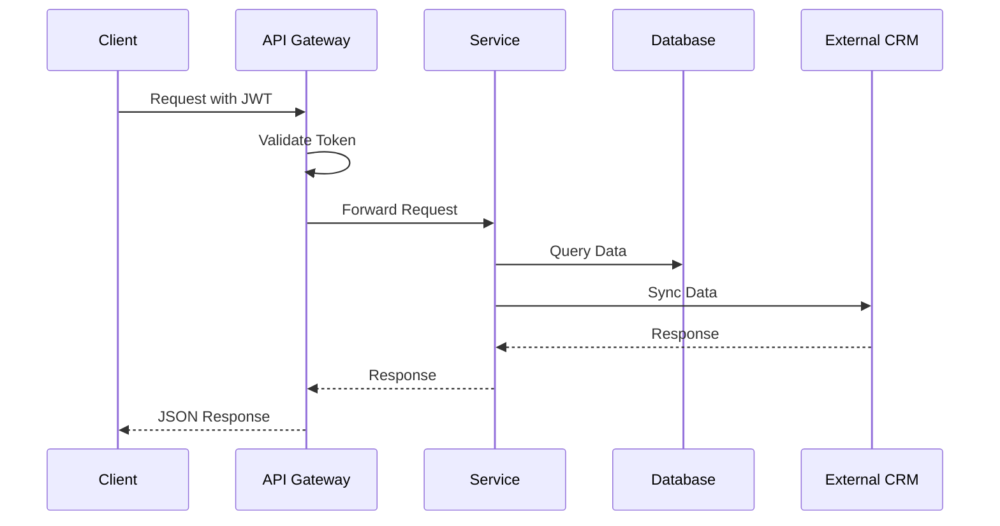
```mermaid
sequenceDiagram
    participant C as Client
    participant A as API Gateway
    participant S as Service
    participant D as Database
    participant E as External CRM

    C->>A: Request with JWT
    A->>A: Validate Token
    A->>S: Forward Request
    S->>D: Query Data
    S->>E: Sync Data
    E-->>S: Response
    S-->>A: Response
    A-->>C: JSON Response
```

# 4. TECHNOLOGY STACK

## 4.1 PROGRAMMING LANGUAGES

| Platform | Language | Version | Justification |
|----------|----------|---------|---------------|
| Frontend | TypeScript | 4.9.x | Type safety, better IDE support, reduced runtime errors |
| Frontend | JavaScript (ES2022) | ES2022 | Browser compatibility, React ecosystem |
| Backend | Node.js | 18.x LTS | JavaScript ecosystem consistency, async performance |
| Build Tools | JavaScript | ES2022 | Native package management, build optimization |

## 4.2 FRAMEWORKS & LIBRARIES

### 4.2.1 Core Frontend Stack

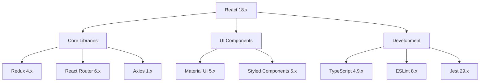
```mermaid
graph TD
    A[React 18.x] --> B[Core Libraries]
    B --> C[Redux 4.x]
    B --> D[React Router 6.x]
    B --> E[Axios 1.x]
    
    A --> F[UI Components]
    F --> G[Material UI 5.x]
    F --> H[Styled Components 5.x]
    
    A --> I[Development]
    I --> J[TypeScript 4.9.x]
    I --> K[ESLint 8.x]
    I --> L[Jest 29.x]
```

### 4.2.2 Supporting Libraries

| Category | Library | Version | Purpose |
|----------|---------|---------|----------|
| State Management | Redux Toolkit | 1.9.x | Simplified Redux setup, RTK Query |
| Data Fetching | RTK Query | 1.9.x | API data fetching, caching |
| Forms | React Hook Form | 7.x | Form validation, performance |
| Charts | Chart.js | 4.x | Visitor analytics visualization |
| Date/Time | Day.js | 1.11.x | Date manipulation, formatting |
| WebSocket | Socket.io-client | 4.x | Real-time visitor updates |

## 4.3 DATABASES & STORAGE

### 4.3.1 Database Architecture

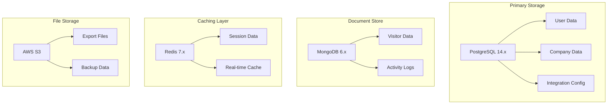
```mermaid
graph TD
    subgraph "Primary Storage"
        A[PostgreSQL 14.x] --> B[User Data]
        A --> C[Company Data]
        A --> D[Integration Config]
    end
    
    subgraph "Document Store"
        E[MongoDB 6.x] --> F[Visitor Data]
        E --> G[Activity Logs]
    end
    
    subgraph "Caching Layer"
        H[Redis 7.x] --> I[Session Data]
        H --> J[Real-time Cache]
    end
    
    subgraph "File Storage"
        K[AWS S3] --> L[Export Files]
        K --> M[Backup Data]
    end
```

### 4.3.2 Storage Strategy

| Storage Type | Technology | Usage Pattern | Retention |
|--------------|------------|---------------|-----------|
| RDBMS | PostgreSQL 14.x | Transactional data | Full retention |
| Document DB | MongoDB 6.x | Visitor tracking | 12-month rolling |
| Cache | Redis 7.x | Session, real-time | Temporary |
| Object Storage | AWS S3 | Files, backups | Configurable |

## 4.4 THIRD-PARTY SERVICES

### 4.4.1 Service Architecture

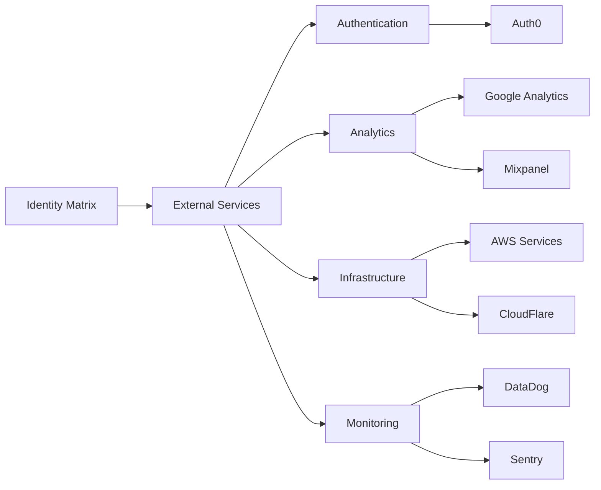
```mermaid
graph LR
    A[Identity Matrix] --> B[External Services]
    
    B --> C[Authentication]
    C --> C1[Auth0]
    
    B --> D[Analytics]
    D --> D1[Google Analytics]
    D --> D2[Mixpanel]
    
    B --> E[Infrastructure]
    E --> E1[AWS Services]
    E --> E2[CloudFlare]
    
    B --> F[Monitoring]
    F --> F1[DataDog]
    F --> F2[Sentry]
```

### 4.4.2 Service Integration Matrix

| Service Category | Provider | Purpose | Integration Method |
|-----------------|----------|---------|-------------------|
| Authentication | Auth0 | User auth | OAuth 2.0/OIDC |
| CDN | CloudFlare | Content delivery | DNS/SSL |
| Monitoring | DataDog | Performance monitoring | API/Agent |
| Error Tracking | Sentry | Error reporting | SDK |
| Email | SendGrid | Transactional email | REST API |
| Payment | Stripe | Subscription handling | SDK/Webhooks |

## 4.5 DEVELOPMENT & DEPLOYMENT

### 4.5.1 Development Pipeline

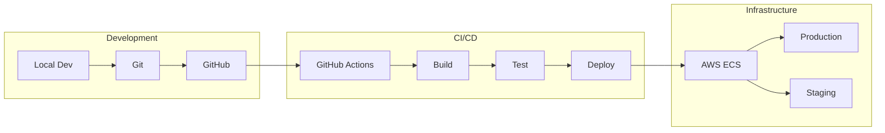
```mermaid
graph LR
    subgraph "Development"
        A[Local Dev] --> B[Git]
        B --> C[GitHub]
    end
    
    subgraph "CI/CD"
        C --> D[GitHub Actions]
        D --> E[Build]
        E --> F[Test]
        F --> G[Deploy]
    end
    
    subgraph "Infrastructure"
        G --> H[AWS ECS]
        H --> I[Production]
        H --> J[Staging]
    end
```

### 4.5.2 Development Tools

| Category | Tool | Version | Purpose |
|----------|------|---------|----------|
| IDE | VS Code | Latest | Development environment |
| Version Control | Git | 2.x | Source control |
| Package Manager | npm | 8.x | Dependency management |
| Build Tool | Vite | 4.x | Development/production builds |
| Testing | Jest/RTL | 29.x/13.x | Unit/integration testing |
| Containerization | Docker | 20.x | Application containerization |
| Infrastructure | Terraform | 1.4.x | Infrastructure as code |

# 5. SYSTEM DESIGN

## 5.1 USER INTERFACE DESIGN

### 5.1.1 Layout Structure

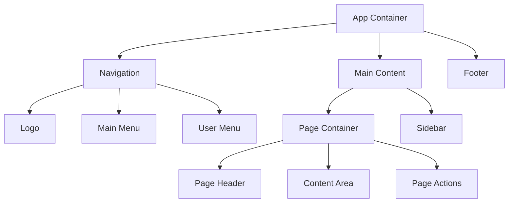
```mermaid
graph TD
    A[App Container] --> B[Navigation]
    A --> C[Main Content]
    A --> D[Footer]
    
    B --> B1[Logo]
    B --> B2[Main Menu]
    B --> B3[User Menu]
    
    C --> C1[Page Container]
    C --> C2[Sidebar]
    
    C1 --> C1A[Page Header]
    C1 --> C1B[Content Area]
    C1 --> C1C[Page Actions]
```

### 5.1.2 Component Hierarchy

| Component Level | Components | Purpose |
|----------------|------------|----------|
| Layout | AppShell, Navigation, MainContent | Base structure |
| Common | Button, Input, Card, Table | Reusable UI elements |
| Features | VisitorList, IntegrationCard, TeamTable | Feature-specific components |
| Pages | PulsePage, IntegrationsPage, SettingsPage | Page containers |

### 5.1.3 Theme Implementation

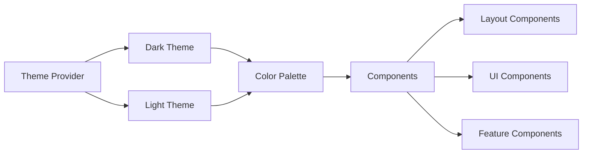
```mermaid
graph LR
    A[Theme Provider] --> B[Dark Theme]
    A --> C[Light Theme]
    
    B --> D[Color Palette]
    C --> D
    D --> E[Components]
    
    E --> F[Layout Components]
    E --> G[UI Components]
    E --> H[Feature Components]
```

## 5.2 DATABASE DESIGN

### 5.2.1 Data Models

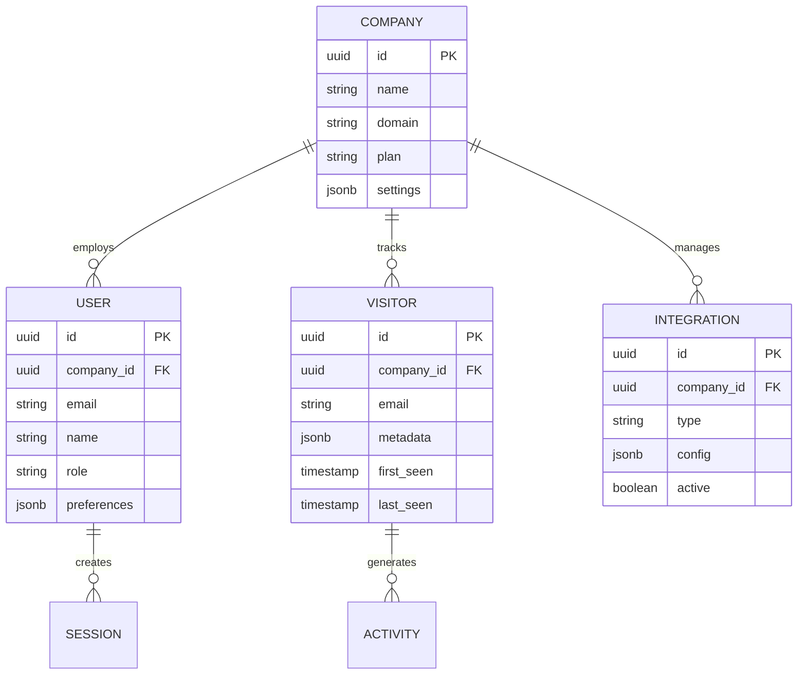
```mermaid
erDiagram
    COMPANY ||--o{ USER : employs
    COMPANY ||--o{ VISITOR : tracks
    COMPANY ||--o{ INTEGRATION : manages
    VISITOR ||--o{ ACTIVITY : generates
    USER ||--o{ SESSION : creates
    
    COMPANY {
        uuid id PK
        string name
        string domain
        string plan
        jsonb settings
    }
    
    USER {
        uuid id PK
        uuid company_id FK
        string email
        string name
        string role
        jsonb preferences
    }
    
    VISITOR {
        uuid id PK
        uuid company_id FK
        string email
        jsonb metadata
        timestamp first_seen
        timestamp last_seen
    }
    
    INTEGRATION {
        uuid id PK
        uuid company_id FK
        string type
        jsonb config
        boolean active
    }
```

### 5.2.2 Database Schema

| Table | Primary Key | Foreign Keys | Indexes |
|-------|-------------|--------------|----------|
| companies | id | - | domain, plan |
| users | id | company_id | email, role |
| visitors | id | company_id | email, first_seen |
| integrations | id | company_id | type, active |
| activities | id | visitor_id | timestamp |

## 5.3 API DESIGN

### 5.3.1 REST Endpoints

```mermaid
graph TD
    subgraph "Authentication"
        A[/auth/login]
        B[/auth/register]
        C[/auth/refresh]
    end
    
    subgraph "Visitors"
        D[/visitors]
        E[/visitors/:id]
        F[/visitors/search]
    end
    
    subgraph "Integrations"
        G[/integrations]
        H[/integrations/:id]
        I[/integrations/connect]
    end
    
    subgraph "Team"
        J[/team]
        K[/team/invite]
        L[/team/:id]
    end
```

### 5.3.2 API Response Structure

| Endpoint | Method | Request Body | Response |
|----------|---------|--------------|-----------|
| /auth/login | POST | {email, password} | {token, user} |
| /visitors | GET | - | {visitors[], pagination} |
| /integrations | POST | {type, config} | {integration} |
| /team/invite | POST | {email, role} | {invitation} |

### 5.3.3 WebSocket Events

```mermaid
sequenceDiagram
    participant C as Client
    participant S as Server
    participant DB as Database
    
    C->>S: connect(auth_token)
    S->>C: connected
    
    S->>C: visitor_activity
    Note over C: Update UI
    
    C->>S: subscribe_company
    S->>DB: watch_visitors
    DB-->>S: visitor_update
    S->>C: visitor_data
```

### 5.3.4 Error Handling

| Error Code | Type | Response Format |
|------------|------|-----------------|
| 400 | Bad Request | {error: string, details: object} |
| 401 | Unauthorized | {error: string, code: string} |
| 403 | Forbidden | {error: string, required_role: string} |
| 404 | Not Found | {error: string, resource: string} |
| 500 | Server Error | {error: string, reference: string} |

# 6. USER INTERFACE DESIGN

## 6.1 Common Components

### 6.1.1 Navigation Bar
```
+----------------------------------------------------------+
| [#] Identity Matrix    [@]Profile  [=]Settings  [?]Help   |
+----------------------------------------------------------+
|  Pulse  Integrations  Team  Settings                      |
+----------------------------------------------------------+
```

### 6.1.2 Page Layout Structure
```
+----------------------------------------------------------+
|                     Navigation Bar                         |
+------------------+-------------------------------------+
|                  |                                     |
|    Sidebar       |        Main Content Area           |
|    Navigation    |                                    |
|                  |                                    |
|    [#] Dashboard |                                    |
|    [@] Profile   |                                    |
|    [=] Settings  |                                    |
|    [?] Help      |                                    |
|                  |                                    |
+------------------+-------------------------------------+
```

## 6.2 Authentication Pages

### 6.2.1 Login Page
```
+----------------------------------------------------------+
|                    Identity Matrix                         |
+----------------------------------------------------------+
|                                                           |
|                    [i] Welcome Back                       |
|                                                           |
|    Email:    [......................................]     |
|    Password: [......................................]     |
|                                                           |
|    [ ] Remember me         [Forgot Password?]             |
|                                                           |
|    [        Sign In        ]                             |
|                                                           |
|    Don't have an account? [Sign Up]                      |
|                                                           |
+----------------------------------------------------------+
```

### 6.2.2 Sign Up Page
```
+----------------------------------------------------------+
|                    Identity Matrix                         |
+----------------------------------------------------------+
|                                                           |
|              [i] Create Your Account                      |
|                                                           |
|    Full Name: [......................................]    |
|    Email:     [......................................]    |
|    Password:  [......................................]    |
|    Company:   [......................................]    |
|    Website:   [......................................]    |
|                                                           |
|    [ ] I agree to Terms of Service and Privacy Policy     |
|                                                           |
|    [        Create Account        ]                       |
|                                                           |
|    Already have an account? [Sign In]                     |
|                                                           |
+----------------------------------------------------------+
```

## 6.3 Main Application Pages

### 6.3.1 Pulse Page (Visitor Tracking)
```
+----------------------------------------------------------+
|    Pulse                                     [^] Export    |
+----------------------------------------------------------+
| Search: [........................] [v] Filter              |
+----------------------------------------------------------+
| Visitor List                                              |
|                                                           |
| +------------------------------------------------------+ |
| | Name         Company      Email         Last Seen     | |
| |------------------------------------------------------| |
| | John Doe     Acme Inc    j@acme.com    2 mins ago    | |
| | Sarah Smith  Tech Co     s@tech.co     15 mins ago   | |
| | Mike Jones   Dev Corp    m@dev.co      1 hour ago    | |
| +------------------------------------------------------+ |
|                                                           |
| [<] 1 2 3 ... 10 [>]                                     |
+----------------------------------------------------------+
```

### 6.3.2 Integrations Page
```
+----------------------------------------------------------+
|    Integrations                            [+] Add New     |
+----------------------------------------------------------+
| Available CRM Integrations                                 |
|                                                           |
| +------------------------+ +------------------------+      |
| |  [*] Salesforce        | |  [ ] HubSpot          |      |
| |  [Connected]           | |  [Connect]            |      |
| |  Last sync: 5 min ago  | |                       |      |
| +------------------------+ +------------------------+      |
|                                                           |
| +------------------------+ +------------------------+      |
| |  [ ] Pipedrive         | |  [ ] Zoho CRM         |      |
| |  [Connect]             | |  [Connect]            |      |
| |                        | |                       |      |
| +------------------------+ +------------------------+      |
+----------------------------------------------------------+
```

### 6.3.3 User Settings Page
```
+----------------------------------------------------------+
|    Settings                                               |
+----------------------------------------------------------+
| Profile Information                                       |
|                                                           |
| Name:     [.....John Doe.............................]    |
| Email:    [.....john@example.com......................]   |
| Company:  [.....Acme Inc.............................]    |
|                                                           |
| [        Save Changes        ]                            |
+----------------------------------------------------------+
| Theme Preferences                                         |
|                                                           |
| Theme:    (•) Dark  ( ) Light                            |
|                                                           |
| [        Apply Theme         ]                            |
+----------------------------------------------------------+
| Password Change                                           |
|                                                           |
| Current:  [......................................]        |
| New:      [......................................]        |
| Confirm:  [......................................]        |
|                                                           |
| [        Update Password      ]                           |
+----------------------------------------------------------+
```

### 6.3.4 Company Team Page
```
+----------------------------------------------------------+
|    Team Management                         [+] Invite      |
+----------------------------------------------------------+
| Active Team Members                                        |
|                                                           |
| +------------------------------------------------------+ |
| | Name         Role         Email            Status     | |
| |------------------------------------------------------| |
| | John Doe     Admin       j@acme.com       Active     | |
| | Sarah Smith  Member      s@acme.com       Active     | |
| | Mike Jones   Viewer      m@acme.com       Pending    | |
| +------------------------------------------------------+ |
|                                                           |
| Pending Invitations                                       |
| +------------------------------------------------------+ |
| | Email            Role         Sent           Action   | |
| |------------------------------------------------------| |
| | p@acme.com       Member      2 days ago     [x]      | |
| +------------------------------------------------------+ |
+----------------------------------------------------------+
```

## 6.4 UI Component Key

| Symbol | Meaning |
|--------|---------|
| [#] | Dashboard/Menu icon |
| [@] | User/Profile icon |
| [=] | Settings icon |
| [?] | Help icon |
| [+] | Add/Create action |
| [x] | Close/Delete action |
| [<][>] | Navigation arrows |
| [^] | Export/Upload action |
| [*] | Connected/Active state |
| [...] | Text input field |
| [v] | Dropdown menu |
| ( ) | Radio button |
| [ ] | Checkbox |
| [Button] | Action button |

## 6.5 Theme Specifications

| Element | Dark Theme | Light Theme |
|---------|------------|-------------|
| Background | #1a1a1a | #ffffff |
| Primary Color | #813efb | #813efb |
| Text Color | #ffffff | #000000 |
| Border Color | #333333 | #e0e0e0 |
| Input Background | #2d2d2d | #f5f5f5 |
| Hover State | #813efb20 | #813efb10 |

# 7. SECURITY CONSIDERATIONS

## 7.1 AUTHENTICATION AND AUTHORIZATION

### 7.1.1 Authentication Flow

```mermaid
sequenceDiagram
    participant U as User
    participant F as Frontend
    participant A as Auth Service
    participant D as Database
    participant J as JWT Service

    U->>F: Login Request
    F->>A: Authenticate
    A->>D: Verify Credentials
    D-->>A: User Data
    A->>J: Generate Tokens
    J-->>A: Access & Refresh Tokens
    A-->>F: Auth Response
    F-->>U: Login Success
```

### 7.1.2 Authorization Matrix

| Role | Pulse Page | Integrations | Team Management | Settings | Billing |
|------|------------|--------------|-----------------|-----------|---------|
| Admin | Full Access | Full Access | Full Access | Full Access | Full Access |
| Manager | Full Access | View & Connect | View & Invite | Own Settings | View Only |
| Member | View Only | View Only | View Only | Own Settings | No Access |
| Viewer | View Only | No Access | No Access | Own Settings | No Access |

## 7.2 DATA SECURITY

### 7.2.1 Data Protection Measures

| Data Type | Storage Method | Encryption | Access Control |
|-----------|---------------|------------|----------------|
| User Credentials | PostgreSQL | Bcrypt (Cost 12) | Service Level |
| Session Tokens | Redis | AES-256 | Token-based |
| PII Data | PostgreSQL | AES-256 | Role-based |
| Integration Tokens | PostgreSQL | AES-256 | Service Level |
| Visitor Data | MongoDB | Field-level AES | Company-based |

### 7.2.2 Data Flow Security

```mermaid
flowchart TD
    A[Client Browser] -->|TLS 1.3| B[CloudFlare]
    B -->|TLS 1.3| C[Load Balancer]
    C -->|TLS 1.3| D[API Gateway]
    
    subgraph Security Layer
        D -->|JWT Validation| E[Auth Middleware]
        E -->|Role Check| F[Services]
    end
    
    subgraph Data Layer
        F -->|Encrypted| G[(Primary DB)]
        F -->|Encrypted| H[(Cache)]
        F -->|Encrypted| I[(Document DB)]
    end
```

## 7.3 SECURITY PROTOCOLS

### 7.3.1 Security Standards Implementation

| Category | Standard | Implementation |
|----------|----------|----------------|
| Transport Security | TLS 1.3 | Enforced HTTPS with HSTS |
| API Security | OAuth 2.0 + PKCE | JWT with short expiration |
| Password Security | NIST 800-63B | Minimum 12 chars, complexity rules |
| Session Management | OWASP Session Management | HTTP-only cookies, rotation |
| CORS Policy | Strict Origin | Whitelist-based allowed origins |
| CSP Headers | Level 2 | Strict content source policy |

### 7.3.2 Security Monitoring

```mermaid
flowchart LR
    subgraph Detection
        A[WAF] --> B[Rate Limiting]
        B --> C[Anomaly Detection]
        C --> D[Audit Logging]
    end
    
    subgraph Response
        D --> E[Alert System]
        E --> F[Incident Response]
        F --> G[Auto-blocking]
    end
    
    subgraph Prevention
        G --> H[IP Reputation]
        H --> I[Request Validation]
        I --> A
    end
```

### 7.3.3 Security Controls

| Control Type | Measure | Description |
|--------------|---------|-------------|
| Preventive | Input Validation | XSS, SQLi, CSRF prevention |
| Detective | Activity Monitoring | Real-time threat detection |
| Corrective | Auto-remediation | Automated threat response |
| Deterrent | Rate Limiting | Brute force prevention |
| Recovery | Backup System | Point-in-time recovery |

### 7.3.4 Compliance Requirements

| Requirement | Implementation | Validation |
|-------------|----------------|------------|
| GDPR | Data encryption, consent management | Quarterly audit |
| SOC 2 | Access controls, monitoring | Annual certification |
| PCI DSS | Secure payment handling | External audit |
| CCPA | Data privacy controls | Regular assessment |
| ISO 27001 | Security management system | Annual review |

# 8. INFRASTRUCTURE

## 8.1 DEPLOYMENT ENVIRONMENT

```mermaid
flowchart TD
    subgraph Production
        A[AWS Cloud] --> B[Multi-AZ Deployment]
        B --> C[Primary Region]
        B --> D[DR Region]
    end
    
    subgraph Environments
        E[Development]
        F[Staging]
        G[Production]
    end
    
    subgraph Network
        H[CloudFront CDN]
        I[Route 53 DNS]
        J[VPC]
    end
    
    H --> C
    I --> H
    C --> J
```

| Environment | Purpose | Configuration |
|-------------|----------|--------------|
| Development | Local development and testing | Single-node, minimal resources |
| Staging | Pre-production testing | Production-like, scaled-down |
| Production | Live system | High-availability, multi-AZ |
| DR | Disaster recovery | Standby, cross-region |

## 8.2 CLOUD SERVICES

### AWS Service Stack

| Service | Usage | Justification |
|---------|--------|--------------|
| EKS | Container orchestration | Managed Kubernetes for scalability |
| RDS | PostgreSQL database | Managed relational database with high availability |
| DocumentDB | MongoDB workloads | Managed document store for visitor data |
| ElastiCache | Redis caching | In-memory caching for performance |
| CloudFront | CDN | Global content delivery and edge caching |
| S3 | Object storage | Static assets and backup storage |
| SQS | Message queuing | Asynchronous task processing |

### Monitoring & Security Services

| Service | Purpose | Implementation |
|---------|---------|----------------|
| CloudWatch | Monitoring and alerts | System and application metrics |
| AWS WAF | Web application firewall | DDoS protection and security rules |
| AWS Shield | DDoS protection | Advanced DDoS mitigation |
| AWS KMS | Key management | Encryption key management |

## 8.3 CONTAINERIZATION

```mermaid
graph TD
    subgraph Container Architecture
        A[Base Images] --> B[Application Images]
        B --> C[Production Containers]
        
        D[Node.js Base] --> E[Frontend Container]
        D --> F[Backend Services]
        
        G[Nginx Base] --> H[Reverse Proxy]
    end
```

### Docker Configuration

| Component | Base Image | Purpose |
|-----------|------------|----------|
| Frontend | node:18-alpine | React application serving |
| Backend | node:18-alpine | API and service containers |
| Proxy | nginx:alpine | Reverse proxy and SSL termination |
| Tools | alpine:latest | Utility containers |

## 8.4 ORCHESTRATION

```mermaid
flowchart TD
    subgraph Kubernetes Architecture
        A[Ingress Controller] --> B[Service Mesh]
        B --> C[Application Pods]
        
        C --> D[Frontend Pods]
        C --> E[Backend Pods]
        C --> F[Worker Pods]
        
        G[ConfigMaps] --> C
        H[Secrets] --> C
    end
```

### Kubernetes Resources

| Resource Type | Purpose | Configuration |
|--------------|---------|---------------|
| Deployments | Application workloads | Rolling updates, auto-scaling |
| Services | Internal networking | Load balancing, service discovery |
| Ingress | External access | SSL termination, routing |
| ConfigMaps | Configuration | Environment-specific configs |
| Secrets | Sensitive data | Encrypted credentials storage |

## 8.5 CI/CD PIPELINE

```mermaid
flowchart LR
    A[GitHub] --> B[GitHub Actions]
    B --> C{Tests Pass?}
    C -->|Yes| D[Build Images]
    C -->|No| E[Notify Team]
    D --> F[Push to Registry]
    F --> G{Environment}
    G --> H[Deploy to Dev]
    G --> I[Deploy to Staging]
    G --> J[Deploy to Prod]
```

### Pipeline Stages

| Stage | Tools | Purpose |
|-------|-------|---------|
| Source Control | GitHub | Code versioning and collaboration |
| CI Runner | GitHub Actions | Automated build and test execution |
| Testing | Jest, React Testing Library | Unit and integration testing |
| Security Scan | SonarQube, OWASP | Code quality and security analysis |
| Build | Docker | Container image creation |
| Registry | ECR | Container image storage |
| Deployment | ArgoCD | GitOps-based deployment |

### Deployment Strategy

| Environment | Strategy | Automation |
|------------|----------|------------|
| Development | Direct deployment | On commit to develop |
| Staging | Blue/Green | On PR merge to main |
| Production | Canary | Manual approval required |
| Rollback | Automated | Previous version restore |

# 8. APPENDICES

## 8.1 ADDITIONAL TECHNICAL INFORMATION

### 8.1.1 Browser Support Matrix

| Browser | Minimum Version | Notes |
|---------|----------------|--------|
| Chrome | 83+ | Full support for all features |
| Firefox | 78+ | Full support for all features |
| Safari | 13+ | Limited dark mode support |
| Edge | 84+ | Full support for all features |
| Mobile Safari | iOS 13+ | Responsive design optimized |
| Chrome Mobile | 83+ | Touch interactions supported |

### 8.1.2 Performance Benchmarks

```mermaid
graph LR
    A[Performance Metrics] --> B[Load Time]
    A --> C[API Response]
    A --> D[Memory Usage]
    
    B --> B1[First Paint < 1s]
    B --> B2[FCP < 1.5s]
    B --> B3[TTI < 2.5s]
    
    C --> C1[Endpoint < 200ms]
    C --> C2[WebSocket < 50ms]
    
    D --> D1[Runtime < 100MB]
    D --> D2[Heap < 150MB]
```

## 8.2 GLOSSARY

| Term | Definition |
|------|------------|
| First Contentful Paint (FCP) | Time when the first content element is rendered on screen |
| Time to Interactive (TTI) | Time until the page becomes fully interactive |
| WebSocket | Protocol providing full-duplex communication for real-time updates |
| Redux Store | Centralized state container for React applications |
| OAuth Flow | Authorization protocol for secure third-party authentication |
| JWT Token | JSON Web Token used for secure API authentication |
| React Component | Reusable UI building block in React applications |
| API Gateway | Entry point for all API requests in the system |
| Dark Mode | UI color scheme optimized for low-light environments |
| Lead Enrichment | Process of adding additional data to visitor information |

## 8.3 ACRONYMS

| Acronym | Full Form |
|---------|-----------|
| FCP | First Contentful Paint |
| TTI | Time to Interactive |
| DOM | Document Object Model |
| SSR | Server Side Rendering |
| CSR | Client Side Rendering |
| SEO | Search Engine Optimization |
| CORS | Cross-Origin Resource Sharing |
| XSS | Cross-Site Scripting |
| CSRF | Cross-Site Request Forgery |
| CDN | Content Delivery Network |
| DNS | Domain Name System |
| SSL | Secure Sockets Layer |
| TLS | Transport Layer Security |
| HTTP | Hypertext Transfer Protocol |
| HTTPS | Hypertext Transfer Protocol Secure |
| WSS | WebSocket Secure |
| HTML | Hypertext Markup Language |
| CSS | Cascading Style Sheets |
| JSON | JavaScript Object Notation |
| XML | Extensible Markup Language |
| API | Application Programming Interface |
| SDK | Software Development Kit |
| IDE | Integrated Development Environment |
| NPM | Node Package Manager |
| URL | Uniform Resource Locator |
| UI | User Interface |
| UX | User Experience |
| PII | Personally Identifiable Information |
| CRM | Customer Relationship Management |
| B2B | Business to Business |